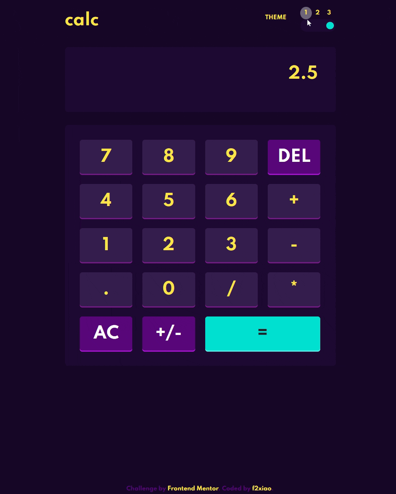

# Frontend Mentor - Calculator app solution


This is a solution to the [Calculator app challenge on Frontend Mentor](https://www.frontendmentor.io/challenges/calculator-app-9lteq5N29) and [Project Calculator on the Odin Project ](https://www.theodinproject.com/lessons/foundations-calculator). 

## Table of contents

- [Overview](#overview)
  - [The challenge](#the-challenge)
  - [Screenshot](#screenshot)
  - [Links](#links)
- [My process](#my-process)
  - [Built with](#built-with)
  - [What I learned](#what-i-learned)
  - [Continued development](#continued-development)
  - [Useful resources](#useful-resources)
- [Author](#author)

## Overview

The is my solution for the project calculator on the Odin Project.

### The challenge

Users should be able to:

- See the size of the elements adjust based on their device's screen size
- Perform mathmatical operations like addition, subtraction, multiplication, and division
- Adjust the color theme based on their preference
- **Bonus**: Have their initial theme preference checked using `prefers-color-scheme` and have any additional changes saved in the browser

### Screenshot



### Links

- Solution URL: [Source code here](https://github.com/f2xiao/Calculator-App)
- Live Site URL: [live here](https://f2xiao.github.io/Calculator-App/)

## My process

### Built with

- Semantic HTML5 markup
- CSS custom properties
- Flexbox
- CSS Grid
- Desktop-first workflow
- [JS](http://vanilla-js.com/) - Vanilla JS
- [Web APIs](https://developer.mozilla.org/en-US/docs/Web/API) 
- [DOM](https://developer.mozilla.org/en-US/docs/Web/API/Document_Object_Model)

### What I learned

CSS variables combined with attribute selectors for custom themes :


```css
[theme=dark] {
  color: papayawhip;
}
```
initial theme preference checked using `prefers-color-scheme`:

```css

```


### Continued development

- refactor the code using ES6 class

### Useful resources

- [Example resource 1](https://www.theodinproject.com/paths/foundations/courses/foundations/lessons/calculator) - A good summary for what to be covered.


## Author

- Website - [f2xiao](https://f2xiao.github.io/site)
- Github - [@f2xiao](https://github.com/f2xiao)


